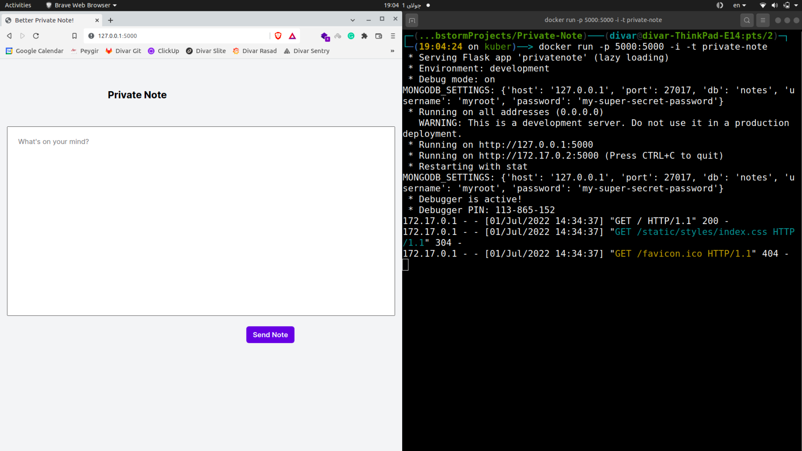

# Private Note

Private Note is a simple note taking web application that allows users to create private notes that can only be viewed
once. It is built using Python, Flask, and MongoDB.

The full description of the project can be found in [instructions.pdf](docs/instructions.pdf)
and [report.pdf](docs/report.pdf).

## Overview

- Users can create a private note and get a unique URL for each note. Notes can only be viewed once - after being viewed
  the note is deleted
- The app is developed using Flask, and uses a MongoDB container as its database.
- The docker-compose, Kubernetes and Helm Chart manifests are also available for deployment.

## API Endpoints

| Endpoint                | Method | Description               | Parameters                         | Responses                                               |
|-------------------------|--------|---------------------------|------------------------------------|---------------------------------------------------------|
| `/`                     | GET    | Returns index page        | None                               | 200 OK <br> Renders `index.html`                        |
| `/create-note`          | POST   | Create new note           | `content`: Note content (required) | 201 Created <br> Returns note URL <br> 500 Server Error |  
| `/note-warn/<note_url>` | GET    | Returns note warning page | `note_url`: Note URL (required)    | 200 OK <br> Renders `warning.html` <br> 404 Not Found   |
| `/note/<note_url>`      | GET    | Returns and deletes note  | `note_url`: Note URL (required)    | 200 OK <br> Returns note content <br> 404 Not Found     |

Notes:

- `NOTE_EXPIRATION` env var sets note expiration time (default 10 days).
- Note URL is randomly generated on creation.
- Notes are stored in MongoDB.

## Running the App

### Local Development

To run the app locally:

```bash
# Install requirements
pip install -r requirements.txt

# Run the app
python app.py
```

The Flask app will run on http://localhost:5000 by default.

### With Docker Compose

```bash
docker-compose up
```

### With Kubernetes

The application can be deployed using the provided manifests or Helm chart. The Helm chart allows customizing the
application name, replica count, resources, and more.

```bash
# Create resources 
kubectl apply -f k8s/

# Deploy Helm chart 
helm install my-release charts/private-note
```

### Configuration

The application is configurable using a ConfigMap and Secret:

**ConfigMap**

- `MONGO_HOST`: Port the MongoDB is running on
- `MONGO_PORT`: Port the MongoDB is running on
- `MONGO_INITDB_DATABASE`: Database name
- `NOTE_EXPIRATION`: Time period for a note to expire and be deleted
- `PORT`: Port the app listens on

**Secret**

- `MONGO_INITDB_ROOT_PASSWORD` - MongoDB password

## Notes

**Docker Multi-stage build**

- Often used to create a leaner version of the container, by removing any packages and modules that are not needed in
  the final image. This is done by creating multiple stages for the build process, in which the files related to
  compilation and other preprocessing procedures are left in the initial images, and only the necessary files are moved
  to the consecutive stages.
- As this project is developed with Python, an Interpretable language, multi-stage building does not offer much of an
  improvement, in terms of size reduction and speed-ups.
- The multistage build is nonetheless implemented, as it was a mandatory part of the assignment. Thus, We
  have `Dockerfile.multi` and `Dockerfile.single` dockerfiles, with the same functionality.
- The multistage process is implemented by
  using [this reference](https://pythonspeed.com/articles/multi-stage-docker-python/).

**StatefulSets**

- Used for MongoDB deployment to maintain a unique identity and stable network ID for each pod.
- Provides consistency and ordering guarantees.
- Allows mounting persistent volumes to pod.

**Horizontal Pod Autoscaler (HPA)**

- Automatically scales the number of Flask app pods based on CPU usage.
- Helps handle increased traffic and load.

**MongoDB Sidecars**

- App write requests go to pod with `master` sidecar.
- Read requests are directed to any pod with `slave` sidecar.

**Helm Charts**

## Demo

<div style="text-align:center;">
  
</div>

## Course Information

- **Course**: Cloud Computing
- **University**: Amirkabir University of Technology
- **Semester**: Spring 2022

Let me know if you have any questions!
